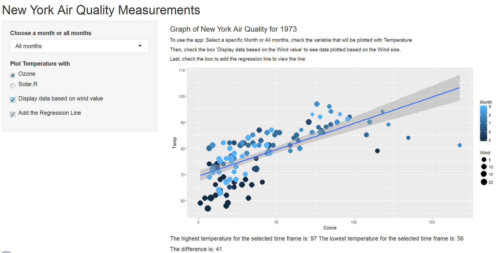
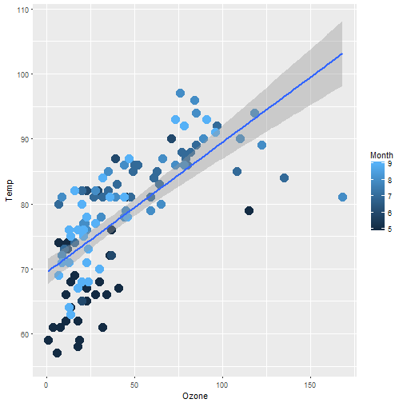

Course Project Presentation for Developing Data Products
========================================================
author: Ella
date: 07-07-2017
autosize: true

New York Air Quality Analysis
========================================================

<h2>This app explores the relationship between Temperature and Ozone level or Solar Radiation level.   </h2>

- Users view the result in a plot.
- The data used in this app is from R airquality datasets, which has 154 observations and 6 variables (Ozone, Solar.R, Wind, Temp, Month, Day)
- The dataset includes data from May to September of 1973

Dataset
========================================================

```r
head(airquality)
```

```
  Ozone Solar.R Wind Temp Month Day
1    41     190  7.4   67     5   1
2    36     118  8.0   72     5   2
3    12     149 12.6   74     5   3
4    18     313 11.5   62     5   4
5    NA      NA 14.3   56     5   5
6    28      NA 14.9   66     5   6
```

To Use the App
========================================================
- Select a specific Month or "All months"
- Check the variable that will be plotted with Temperature
- Check the box "Display data based on the Wind value" to view data plotted based on the Wind size
- Check the box "Add the Regression Line" to view the the line


Results
========================================================

<h2>The outcome of the plot shows:   </h2>

- The relationship between Ozone and Temperature or Solar.R and Temperature in the selected time period
- The highest and lowest temperature in the selected time period
- The difference between the highest and lowest temperature in the selected time period

Slide With Code
========================================================


Slide With Plot
========================================================


**The complete source code is located at https://github.com/Gu-Go/courseProject.git

Code for a Plot
========================================================

```r
library(ggplot2)
ggplot(airquality,aes(x=Ozone,y=Temp,color=Month)) + geom_point(size=5) + geom_smooth(method="lm")
```


